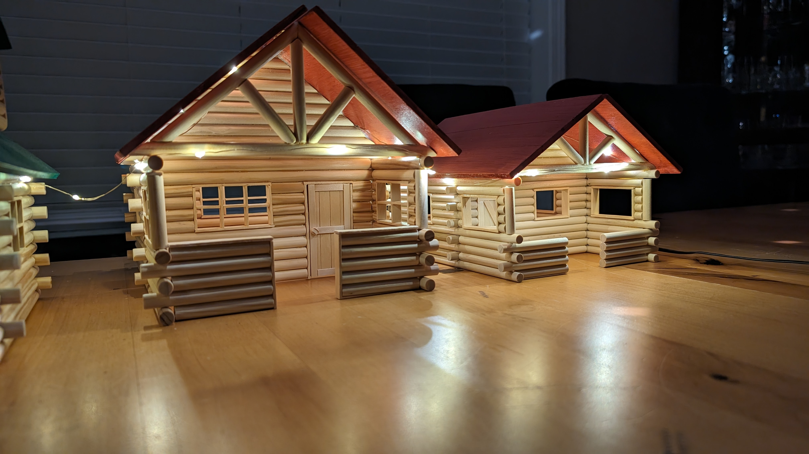

I build (and sell) custom log miniature cabins.

I have a collection of different cabin "models" in which I build different types of
miniature cabins, using the "butt & pass" build design, using only locally sourced spruce.

Roofs are painted using water-based stains and they are detachable.

Cabins can be lit using _fairy lights_, button LED candles or other non-flammable
technologies.

<section id="isso-thread">
    <noscript>Javascript needs to be activated to view comments.</noscript>
</section>
